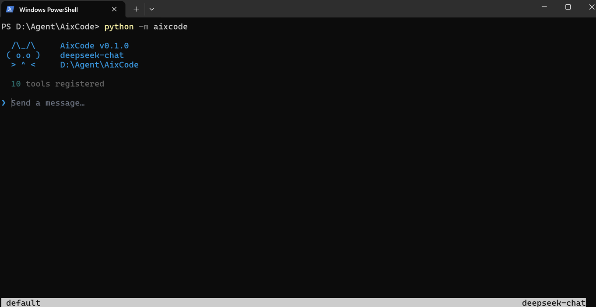
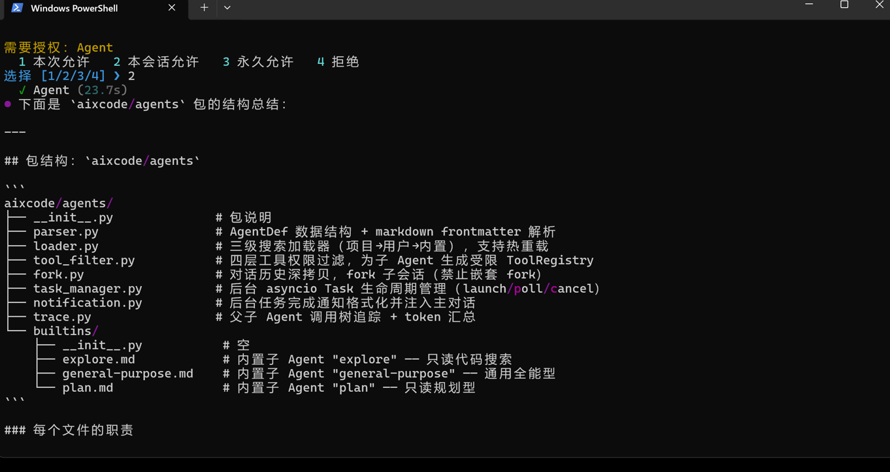
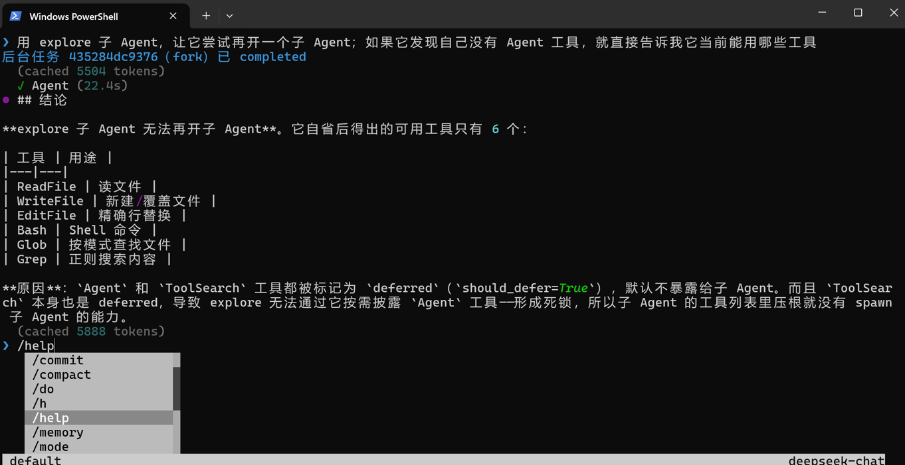

# AixCode

AixCode 是一个用 **Python 从零构建**的终端 AI 编程助手，对标 **Claude Code**，后端默认接 **Deepseek**（OpenAI 兼容协议）。它在你的代码仓库里，通过工具调用完成真实的编程工作：读写文件、执行命令、检索代码、多轮自治、子 Agent 协作。


> **模型负责思考与决策，框架负责工具回环、权限边界与上下文治理——工具是 Agent 触及真实世界的唯一接口。**

逐章从零构建：对话通道 → 工具系统 → ReAct 自治循环 → 权限沙箱 → 上下文压缩 → 记忆 → MCP / Skill / Hook 扩展 → SubAgent / Worktree / AgentTeam 多 Agent 协作 → CLI / Headless 入口。每一章都配 `spec / tasks / checklist` 三件套并以 TDD 落地，当前 **824 个测试全绿**。

<p align="center">
  
</p>

---

## 目录

- [功能特性](#-功能特性)
- [系统架构](#-系统架构) — 分层架构图
- [它是怎么工作的](#-它是怎么工作的) — Agent 回环流程 + 内置工具表
- [安装](#-安装)
- [配置](#-配置)
- [使用](#-使用)
- [更多演示](#-更多演示)
- [核心模块详解](#-核心模块详解)
- [设计取舍](#-设计取舍)
- [还没做的](#-还没做的)
- [项目结构](#-项目结构)

---

## ✨ 功能特性

**核心对话与工具**

- Deepseek / OpenAI 兼容协议的异步**流式对话**
- 内置工具：`ReadFile` / `WriteFile` / `EditFile` / `Bash` / `Glob` / `Grep`，以及 `ToolSearch`（按需披露）、`AskUserQuestion`（向用户提问）
- 统一的 `Tool` 抽象 + 工具注册中心，支持「按需工具」渐进披露，避免一次性塞满上下文

**Agent 自治循环**

- 多轮 **ReAct 循环**：调用模型 → 执行工具 → 回灌结果 → 继续，直到任务完成
- 工具批量执行（只读工具可并发）、流式事件输出

**权限与安全**

- 五档**权限模式**：`strict` / `default` / `accept` / `bypass` / `plan`
- 危险命令检测、路径沙箱、规则引擎、人在回路（HITL）确认
- Plan 模式：只读调研、产出计划待审批

**上下文与记忆**

- 上下文**自动压缩**（按真实 token 数触发）、工具结果预算与持久化
- 自动记忆提取、项目指令（`AIXCODE.md`）注入、发送前 token 预估

**扩展机制**

- **MCP**：接入 MCP server 的 **工具 / 资源（`ReadMcpResource`）/ 提示（`/mcp__server__prompt`）**
- **Skill**：渐进式技能加载（`LoadSkill`）
- **Hook**：15 个生命周期事件 × 四类动作（`command` / `prompt` / `http` / `agent`）
- **Slash 命令**：`/help` `/status` `/compact` `/plan` `/do` `/mode` `/memory` `/session` `/skill` `/tasks` `/trace` `/worktree` 等

**多 Agent 协作**

- **SubAgent**：上下文隔离的子 Agent（同步 / 后台 / fork 三种路径）、调用树追踪、内置 `general-purpose` / `plan` / `explore`
- **Worktree**：基于 git worktree 的隔离工作区，工具按各自 `work_dir` 解析路径
- **AgentTeam**：网状协作团队——多队员并行、邮箱互发消息、共享任务清单，主 Agent 可切 **Coordinator Mode** 专职调度（本机走 in-process 后端）

**CLI 与 Headless**

- 交互式 REPL，或 `-p` **单次执行模式**（跑完打印结果退出，可管道 / 脚本化 / 作为子进程队员）

---

## 🏗️ 系统架构

四层解耦：**入口层**接收用户意图，**编排层**驱动 ReAct 回环并守住权限与上下文边界，**能力层**提供 Agent 触及真实世界的全部手段，**外部层**是模型、协议与文件系统。

```
┌──────────────────────────────────────────────────────────────┐
│  入口层    REPL (rich/prompt_toolkit)   │   Headless  (-p 单次)  │
│            __main__ → cli.parse_args → runtime.assemble_runtime │
└───────────────────────────────┬──────────────────────────────┘
                                 │
┌────────────────────────────────▼─────────────────────────────┐
│  编排层    Agent Loop (ReAct 多轮自治, 流式事件)                  │
│   ┌──────────────┬──────────────┬──────────────┬────────────┐  │
│   │ 权限引擎      │ 上下文压缩    │ 记忆          │ 系统提示    │  │
│   │ 5 档 + 沙箱   │ 真实 token    │ 自动提取      │ 环境注入    │  │
│   └──────────────┴──────────────┴──────────────┴────────────┘  │
└────────────────────────────────┬─────────────────────────────┘
                                 │  工具调用 / 事件
┌────────────────────────────────▼─────────────────────────────┐
│  能力层                                                         │
│   文件&命令工具 · MCP · Skill · Hook · Slash 命令               │
│   SubAgent (fork/后台) · Worktree (git 隔离) · AgentTeam (网状)  │
└────────────────────────────────┬─────────────────────────────┘
                                 │
┌────────────────────────────────▼─────────────────────────────┐
│  外部层    Deepseek API   │   MCP servers   │   git / 文件系统   │
└──────────────────────────────────────────────────────────────┘
```

---

## ⚙️ 它是怎么工作的

每一轮，Agent 把对话历史 + 工具 schema 发给模型，模型要么直接回答、要么发起工具调用；框架执行工具（受权限引擎把关）、把结果回灌进对话，再进入下一轮——直到模型不再调用工具：

```
用户输入
   │
   ▼
┌─────────────┐   无工具调用   ┌──────────────┐
│  调用模型     │ ───────────► │  输出最终回答  │
│  (流式)      │               └──────────────┘
└──────┬──────┘
       │ 有工具调用
       ▼
┌─────────────┐   ask/危险    ┌──────────────┐
│  权限引擎     │ ───────────► │ HITL 确认/拒绝 │
└──────┬──────┘               └──────────────┘
       │ 放行
       ▼
┌─────────────┐
│  执行工具     │  (只读工具可并发批量)
└──────┬──────┘
       │ 回灌结果 + 检查是否需压缩上下文
       └──────────────► 回到「调用模型」
```

### 内置工具

| 工具                 | 干什么                                          | 类别 / 特性                     |
| -------------------- | ----------------------------------------------- | ------------------------------- |
| `ReadFile`           | 读文件（按行 / 范围）                            | read                            |
| `WriteFile`          | 写 / 覆盖文件                                    | write                           |
| `EditFile`           | 精确字符串替换                                   | write                           |
| `Bash`               | 执行 shell 命令                                  | command · 受危险命令检测        |
| `Glob`               | 文件名模式匹配                                   | read · 并发安全                 |
| `Grep`               | 内容检索（ripgrep 风格正则）                     | read · 并发安全                 |
| `ToolSearch`         | 按需取出延迟披露的工具                            | 渐进披露，省上下文              |
| `AskUserQuestion`    | 向用户提问、收集决策                              | HITL                            |
| `LoadSkill`          | 加载技能（渐进式注入能力）                        | Skill 系统                      |
| `ReadMcpResource`    | 读取 MCP server 暴露的资源                        | read · deferred                 |
| `Agent`              | 派生子 Agent（同步 / 后台 / fork）               | SubAgent / 上下文隔离           |
| `SendMessage`        | 给队友 / 子 Agent 发消息                          | AgentTeam 邮箱                  |
| `TeamCreate` 等      | 团队与共享任务管理（Create/Delete/Task*）         | AgentTeam                       |

> 工具按需渐进披露：默认只暴露常用工具，其余经 `ToolSearch` 取出 schema 后再调用，避免一次性塞满上下文。

---

## 🚀 安装

需要 Python 3.10+。

```powershell
git clone https://github.com/Rhapsody233/AixCode.git
cd AixCode
pip install -e .
```

`pip install -e .` 会注册全局命令 `aixcode`（可编辑安装，改代码无需重装）。之后在任意目录都能直接使用。

> 若提示 `aixcode 不是命令`，说明 Python 的 Scripts 目录不在 PATH 上。用
> `python -c "import sysconfig; print(sysconfig.get_path('scripts'))"`
> 查出路径并加入系统 PATH，或改用 `python -m aixcode`。

---

## 🔧 配置

在项目根目录（或运行时的当前目录）创建 `config.yaml`：

```yaml
# 必填：供应商配置
protocol: openai                      # OpenAI 兼容协议（承载 Deepseek）
model: deepseek-chat                  # 或 deepseek-reasoner（带思考链）
base_url: https://api.deepseek.com    # 请求地址
api_key: sk-xxxxxxxxxxxxxxxxxxxx       # 你的 API key
```

四个字段缺一不可。换其他 OpenAI 兼容后端时，改 `base_url` / `model` / `api_key` 即可。

<details>
<summary><b>可选配置（MCP / Hook / 团队）</b></summary>

```yaml
# 接入 MCP server（stdio 或 Streamable HTTP）
mcp_servers:
  local-tools:
    command: python
    args: ["-m", "my_mcp_server"]
  remote-tools:
    url: https://example.com/mcp
    headers:
      Authorization: "Bearer ${MY_TOKEN}"   # ${VAR} 会从环境变量展开

# 生命周期 Hook（command / prompt / http / agent 四类动作）
hooks:
  - event: post_tool_use
    action:
      type: command
      command: "echo 工具已执行"

# AgentTeam（Windows 必须设为 in-process）
teammate_mode: in-process
enable_coordinator_mode: false
```

</details>

---

## 📖 使用

```powershell
# 交互式 REPL
aixcode

# 单次执行（headless）：跑完打印结果退出
aixcode -p "帮我给 utils.py 的 parse() 加单元测试"

# 指定工作目录 / 模型 / 配置
aixcode -p "重构 X" --work-dir D:\repo --model deepseek-reasoner --config D:\AixCode\config.yaml

# 权限模式（默认 default；脚本化场景建议显式声明）
aixcode -p "只调研不动手" --permission-mode strict
```

进入 REPL 后，直接用自然语言下达任务，或用 `/` 调用斜杠命令（`/help` 查看全部）。

---

## 🖼️ 更多演示

<p align="center">
  
</p>

<p align="center">
  
</p>

---

## 🧩 核心模块详解

### Agent 自治循环（`agent.py`）

ReAct 多轮异步生成器：`while True` 里调用模型 → 解析工具调用 → 串行解析权限（`ask` 经人在回路确认）→ 执行工具（只读可并发）→ 回灌结果 → 检查是否需压缩，直到模型不再调用工具。全程以 `AgentEvent`（`StreamText` / `ToolUseEvent` / `ToolResultEvent` / `PermissionRequest` / `LoopComplete` …）流式产出，REPL 与 headless 各自消费同一事件流。

### 权限与沙箱（`permissions/`）

五档模式 `strict / default / accept / bypass / plan` × 四档响应 `allow / allow_session / allow_always / deny`。`DangerousCommandDetector` 拦截高危命令、`PathSandbox` 限制越界写、`RuleEngine` 做规则匹配。headless 下无人应答的 `ask` 一律判 **DENY**，避免脚本 / CI / 子进程里静默执行危险操作。

### 上下文治理（`context/`）

按 **API 返回的真实 token 数**（非字符启发式）触发自动压缩；工具结果有预算上限并可持久化到会话目录、用预览替身回填。`tokenizer.py` 用 tiktoken（缺失时优雅回退字符估算）补上「首轮发送前 `last_input_tokens=0`」的盲区，状态栏实时显示用量。

### MCP 集成（`mcp/`）

基于官方 `mcp` SDK：`MCPClient` 直通 `list/call tools`、`list/read resources`、`list/get prompts`；`MCPManager` 顺序连接多 server、容错注册（单 server 失败不阻塞）、维护 `uri → server` 路由。资源经 `ReadMcpResource(uri)` 读取，提示注册为 `/mcp__<server>__<prompt>` 斜杠命令。

### 多 Agent 协作（`agents/` · `worktree/` · `teams/`）

- **SubAgent**：上下文隔离的子 Agent，支持同步 / 后台任务 / fork 当前对话三种派生路径，带调用树追踪。
- **Worktree**：在 git worktree 里开隔离工作区，工具通过 `ContextVar` 各自解析 `work_dir`，互不干扰。
- **AgentTeam**：网状团队——队员经邮箱互发消息、共享任务清单协同；主 Agent 可切 Coordinator Mode 专职调度。本机走 in-process 后端，跨进程队员经 `-p` headless + 三个 `AIXCODE_*` 环境变量接入共享邮箱。

---

## ⚖️ 设计取舍

- **工具是唯一的世界接口**：模型不直接动文件 / 跑命令，一切外部副作用都过工具 + 权限引擎，便于审计与沙箱。
- **真实 token 而非字符估算驱动压缩**：压缩判定用 API 实际返回的 token 数，token 预估只用于显示与首轮盲区补全，不污染压缩决策。
- **headless 默认拒绝而非放行**：无人值守路径上把安全默认值设为「拒绝」，放宽须显式 `--permission-mode accept/bypass`。
- **装配单一来源**：REPL 与 headless 共用 `assemble_runtime(...)`，杜绝两份装配漂移。
- **可选依赖优雅降级**：tiktoken 等缺失时回退而非报错，核心功能始终可用。

---

## 🚧 还没做的

- 真实 pane 后端（tmux / iTerm2 实际拉起跨进程队员）——接收端已就绪，真实多进程协作待 Unix 环境验收；本机可用「设三个 `AIXCODE_*` env + `-p`」单进程冒烟。
- MCP 反向能力（sampling / roots / elicitation / progress 通知）——目前只做正向消费 tools / resources / prompts。
- headless 续接历史会话（`--resume`）——每次全新会话。
- 全局配置回退（任意目录读 `~/.aixcode/config.yaml`）——规划中。

---

## 🗂️ 项目结构

```
aixcode/
├── agent.py            # 多轮 ReAct 自治循环
├── client.py           # LLM 客户端（OpenAI 兼容流式）
├── conversation.py     # 对话历史模型
├── config.py           # 配置加载
├── cli.py / headless.py / runtime.py   # CLI 入口 / headless / 装配
├── prompts.py          # 系统提示拼装
├── tools/              # 工具系统（文件/Bash/检索 + MCP/Skill/Agent 等）
├── permissions/        # 权限模式 / 沙箱 / 规则引擎
├── context/            # 上下文压缩 / token 预估
├── memory/             # 自动记忆
├── commands/           # Slash 命令
├── skills/             # Skill 系统
├── hooks/              # Hook 引擎（15 生命周期事件 × 4 类动作）
├── agents/             # SubAgent（解析/加载/过滤/fork/追踪）
├── worktree/           # git worktree 隔离
├── teams/              # AgentTeam 协作团队
└── mcp/                # MCP 集成
```

---

## 📝 说明

本项目为逐章构建的终端 AI 编程助手实现，用于学习与实践，覆盖从对话通道到多 Agent 协作的完整链路。欢迎按需改造、扩展后端与工具。
